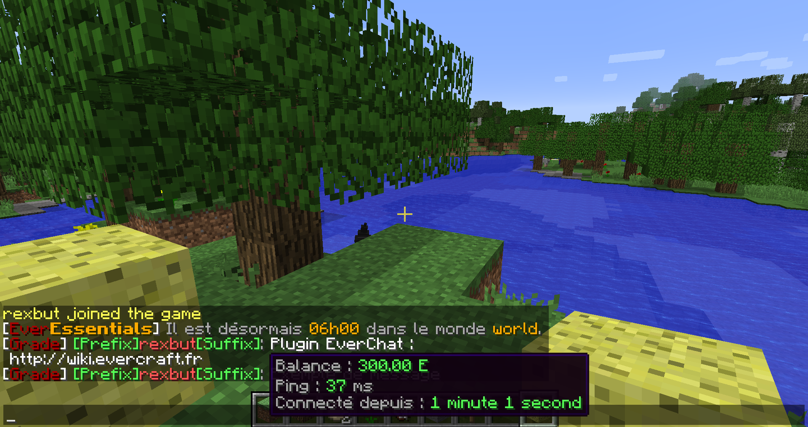

=====================
Mise en forme du chat
=====================

Permet de faire la mise en page du tchat. Les format peuvent utiliser toutes les variables globales.

Le fichier de configuration
~~~~~~~~~~~~~~~~~~~~~~~~~~~

Activation
----------

Tout d'abord il faut activer le formatage du tchat :

.. code-block:: none

	enable-format=true

Format des groupes
------------------

Il est possible de choisir un format différent pour chaque groupe :

.. code-block:: none

	format-groups {
	   Admin="&f[&4Admin&f] <DISPLAYNAME> &7:&f <MESSAGE>"
	   Moderator="&f[&5Mod&f] <DISPLAYNAME> &7:&f <MESSAGE>"
	   Player="&f[&aPlayer&f] <DISPLAYNAME> &7:&f <MESSAGE>"
	}

Format par défaut
-----------------

Cependant si le groupe du joueur n'est pas dans la liste des groupes, le format par défaut sera appliqué :

.. code-block:: none

	format-default="<DISPLAYNAME> &7:&f <MESSAGE>"
