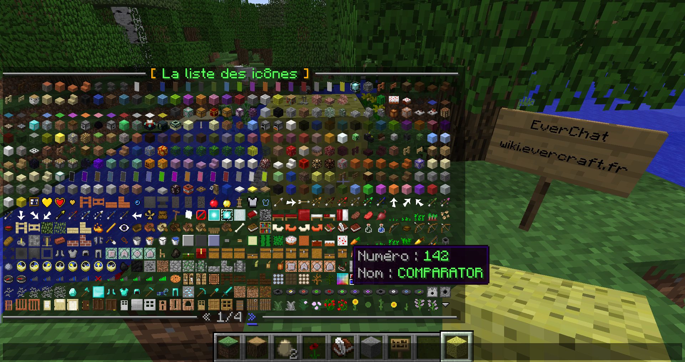

======
Icônes
======

EverResourcePack est un pack de texture qui ajoute uniquement des icônes. Le plugin EverChat permet de gérer facilement les icônes avec la commande "/icon".

Utilisation
~~~~~~~~~~~

Il y a trois solutions pour afficher un icône :

* Ecrire directement le caractère ````
* Utiliser la balise "icon" avec le nom de l'icône ``{icon=COMPARATOR}``
* Utiliser la balise "icon" avec le numéro de l'icône ``{icon=142}``

Liens
~~~~~

.. toctree::
    :maxdepth: 2
    :titlesonly:

-  `Télécharger <https://github.com/EverCraft/EverResourcePack/releases>`_
-  `Code source <https://github.com/EverCraft/EverResourcePack>`_
-  `Issues <https://github.com/EverCraft/EverResourcePack/issues>`_
