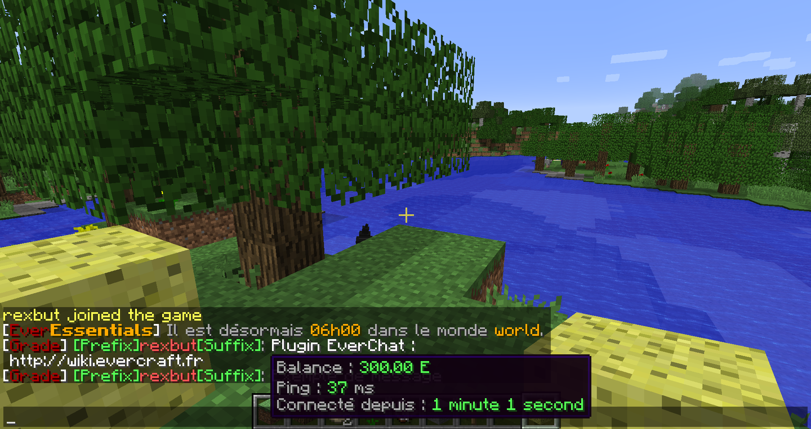

========
EverChat
========

Le plugin EverChat permet de gérer la mise en forme du tchat.

.. toctree::
   :maxdepth: 1
   
   commands
   permissions
   configs
   format_chat
   format_displayname
   icons

Fonctionnalités
~~~~~~~~~~~~~~~

Voici les différentes fonctionnalités du plugin :

- Formatage du tchat
- Affiche le `préfix <format_displayname.html#prefix>`_ et le `suffix <format_displayname.html#suffit>`_ du joueur dans le tchat
- `Affiche diverses informations en survolant le pseudo d'un joueur dans le tchat <format_displayname.html#hover>`_
- `Suggérer une commande quand on clique sur le pseudo d'un joueur dans le tchat <format_displayname.html#suggest>`_
- :doc:`Affiche les icônes dans le tchat grâce à un pack de texture personnalisé <icons>`
- :doc:`Possibilité d'écrire en couleur dans le tchat <../minecraft/format>`

Liens
~~~~~

.. toctree::
    :maxdepth: 2
    :titlesonly:

-  `Télécharger <https://github.com/EverCraft/EverChat/releases>`_
-  `Code source <https://github.com/EverCraft/EverChat>`_
-  `Problème / Suggestion <https://github.com/EverCraft/EverChat/issues>`_
