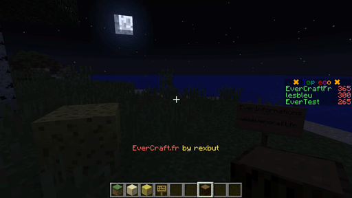

=========
ActionBar
=========

L'AutoMessage ActionBar permet de faire afficher des messages dans interval de temps. 

Tous les messages sont définis dans le fichier de configuration et ils peuvent contenir des `Variables Globales <../../everapi/variables.html#variables-globales>`_ et des `Variables Joueurs <../../everapi/variables.html#variables-joueurs>`_.

Configuration simple
~~~~~~~~~~~~~~~~~~~~

Le fichier de configuration se trouve dans : ``/config/everinformations/automessage/automessage_actionbar.conf``

.. code-block:: bash

	# Permets d'activer ou de désactiver la fonctionnalité
	enable=true
	
	# Le temps entre chaque message (en seconde)
	interval=300
	
	# La durée pendant la quelle les messages vont rester à l'écran (en seconde) 
	stay=20
	
	# La liste des messages
	messages=[
		"&1Message 1 ......",
		"&bMessage 2 ......",
		"&cMessage 3 ......",
		"&aMessage 4 ......"
	]

Configuration Avancée
~~~~~~~~~~~~~~~~~~~~~~

Le fichier de configuration se trouve dans : ``/config/everinformations/automessage/automessage_actionbar.conf``

.. code-block:: bash

	# Permets d'activer ou de désactiver la fonctionnalité
	enable=true
	
	# Le temps entre chaque message (en seconde)
	interval=300
	
	# La liste des messages
	messages=[
		# Configuration normale
		"&aMessage 1 à {TIME} ......",
		
		# Configuration avancée
		{
			# Le temps avant le prochaine message (en seconde)
			next=20
			
			# Le temps d'apparition de ce message (en seconde) 
			stay=60
			
			# Le message en FORMATTING_CODE
			message="&cMessage 2 à {TIME} ......"
		},
		
		# Configuration normale
		"&bMessage 3 à {TIME} ......",
		
		# Configuration avancée
		{
			# Le format du message : FORMATTING_CODE|JSON (Format par défaut : FORMATTING_CODE)
			format="JSON"
			
			# Le message en JSON
			message="{\"hoverEvent\":{\"action\":\"show_text\",\"value\":\"Message Hover\"},\"text\":\"Message en JSON\"}"
		},
		
		# Configuration normale
		"&7Bonjour le joueur : {DISPLAYNAME}",
	]
