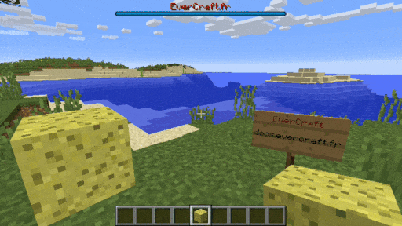

=======
BossBar
=======

L'AutoMessage BossBar permet de faire afficher des messages dans interval de temps. 

Tous les messages sont définis dans le fichier de configuration et ils peuvent contenir des `Variables Globales <../../everapi/variables.html#variables-globales>`_ et des `Variables Joueurs <../../everapi/variables.html#variables-joueurs>`_.

Configuration simple
~~~~~~~~~~~~~~~~~~~~

Le fichier de configuration se trouve dans : ``/config/everinformations/automessage/automessage_bossbar.conf``

.. code-block:: bash

	# Permets d'activer ou de désactiver la fonctionnalité
	enable=true
	
	# Le temps entre chaque message (en seconde)
	interval=300
	
	# La durée pendant la quelle les messages vont rester à l'écran (en seconde)
	stay=20
	
	# La couleur de la BossBar (BLUE|GREEN|PINK|PURPLE|RED|WHITE|YELLOW)
	color=BLUE
	
	# La liste des messages
	messages=[
		"&1Message 1 ......",
		"&bMessage 2 ......",
		"&cMessage 3 ......",
		"&aMessage 4 ......"
	]

Configuration Avancée
~~~~~~~~~~~~~~~~~~~~~~

Le fichier de configuration se trouve dans : ``/config/everinformations/automessage/automessage_bossbar.conf``

.. code-block:: bash

	# Permets d'activer ou de désactiver la fonctionnalité
	enable=true
	
	# Le temps entre chaque message (en seconde)
	interval=300
	
	# La durée pendant la quelle les messages vont rester à l'écran (en seconde)
	stay=20
	
	# La couleur de la BossBar (BLUE|GREEN|PINK|PURPLE|RED|WHITE|YELLOW)
	color=BLUE
	
	# Le pourcentage de la BossBar (0 à 100)
	percent=100
	
	# Le style de la BossBar : (NOTCHED_6|NOTCHED_10|NOTCHED_12|NOTCHED_20|PROGRESS)
	overlay=PROGRESS
	
	# Jouer la musique de départ
	playEndBossMusic=false
	
	# Obscurcir le ciel
	darkenSky=false
	
	# Créer le brouillard
	createFog=false
	
	# La liste des titres et des sous-titres
	messages=[
		# Message avancée
		{
			# Le temps avant le prochaine message (en seconde)
			next=20
			
			# Le temps d'apparition de ce message (en seconde) 
			stay=60
			
			# La couleur de la BossBar de ce message
			color=RED
			
			# Le sous-titre du message
			message="&2Bonjour {DISPLAYNAME}"
		},
		
		# Message avec titre
		{
			# Le titre
			message="&6✖ &1Title 2 &6✖"
		}
	]
