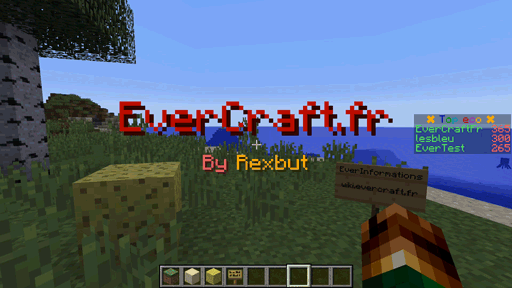

=====
Title
=====

L'AutoMessage Title permet de faire afficher des messages dans interval de temps.

Tous les messages sont définis dans le fichier de configuration et ils peuvent contenir des `Variables Globales <../../everapi/variables.html#variables-globales>`_ et des `Variables Joueurs <../../everapi/variables.html#variables-joueurs>`_.

Configuration simple
~~~~~~~~~~~~~~~~~~~~

Le fichier de configuration se trouve dans : ``/config/everinformations/automessage/automessage_title.conf``

.. code-block:: bash

	# Permets d'activer ou de désactiver la fonctionnalité
	enable=true
	
	# Le temps entre chaque message (en seconde)
	interval=300
	
	# La durée pendant la quelle les titres et les sous-titres vont rester à l'écran (en seconde) 
	stay=20
	
	# La liste des titres et des sous-titres
	messages=[
		# Message avec titre et sous-titre
		{
			# Le titre
			title="&6✖ &1Title 1 &6✖"
			
			# Le sous-titre
			subTitle="&2SubTitle 1"
		},
		
		# Message avec titre
		{
			# Le titre
			title="&6✖ &1Title 2 &6✖"
		},
		
		# Message avec sous-titre
		{
			# Message avec sous-titre
			subTitle="&aSubTitle 3"
		}
	]

Configuration Avancée
~~~~~~~~~~~~~~~~~~~~~

Le fichier de configuration se trouve dans : ``/config/everinformations/automessage/automessage_title.conf``

.. code-block:: bash

	# Permets d'activer ou de désactiver la fonctionnalité
	enable=true
	
	# Le temps entre chaque message (en seconde)
	interval=300
	
	# La durée pendant la quelle les titres et les sous-titres vont rester à l'écran (en seconde) 
	stay=20
	
	# La durée du fondu d'apparition (en seconde)
	fadeIn=1
	
	# La durée du fondu de sortie (en seconde)
	fadeOut=1
	
	# La liste des titres et des sous-titres
	messages=[
		# Message avancée
		{
			# Le temps avant le prochaine message (en seconde)
			next=20
			
			# Le temps d'apparition de ce message (en seconde) 
			stay=60
			
			# La durée du fondu d'apparition de ce message (en seconde)
			fadeIn=0.5
			
			# La durée du fondu de sortie de ce message (en seconde)
			fadeOut=0.5
			
			# Le titre du message
			title="&6✖ &1Title 1 &6✖"
			
			# Le sous-titre du message
			subTitle="&2Bonjour {DISPLAYNAME}"
		},
		
		# Message avec titre
		{
			# Le titre
			title="&6✖ &1Title 2 &6✖"
		}
	]
