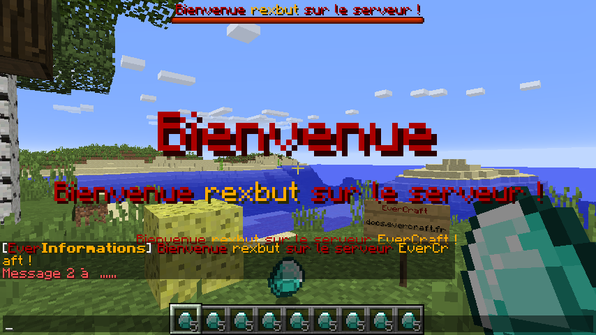

====
Chat
====

Le Connection Chat permet de faire afficher dans le tChat des messages lors de la connexion d'un joueur. Il existe deux types de messages : les messages pour le nouveau joueur et les messages pour les autres joueurs qui sont déjà connectés sur le serveur.

Tous les messages sont définis dans le fichier de configuration et ils peuvent contenir des `Variables Globales <../../everapi/variables.html#variables-globales>`_ et des `Variables Joueurs <../../everapi/variables.html#variables-joueurs>`_.

Configuration simple
~~~~~~~~~~~~~~~~~~~~

Le fichier de configuration se trouve dans : ``/config/fr.evercraft.everinformations/connection/connection_chat.conf``

.. code-block:: bash

	# Pour le nouveau joueur
	player {
		# Permets d'activer ou de désactiver la fonctionnalité
		enable=true
		
		# Le nom du groupe
		DEFAULT {
			# Message lors de la connexion du joueur
			JOIN {
				# Le message
				message="&7&l[&2+&7&l] {DISPLAYNAME} &7vient de rejoindre le serveur"
			}
		}
	}
	
	# Pour les autres joueurs
	others {
		# Permets d'activer ou de désactiver la fonctionnalité
		enable=true
		
		# Le nom du groupe
		DEFAULT {
			# Message lors de la connexion du joueur
			JOIN {
				# Le message
				message="&7&l[&2+&7&l] {DISPLAYNAME} &7vient de rejoindre le serveur"
			}
			
			# Message lors de la déconnexion du joueur
			QUIT {
				# Le message
				message="&7&l[&4-&7&l] {DISPLAYNAME} &7vient de quitter le serveur"
			}
			
			# Message lors de l'expulsion du joueur
			KICK {
				# Le message
				message="&7&l[&4-&7&l] {DISPLAYNAME} &7vient d'être expulser du serveur pour <reason>"
			}
		}
	}

Configuration Avancée
~~~~~~~~~~~~~~~~~~~~~

Le fichier de configuration se trouve dans : ``/config/fr.evercraft.everinformations/connection/connection_chat.conf``

.. code-block:: bash

	# Pour le nouveau joueur
	player {
		# Permets d'activer ou de désactiver la fonctionnalité
		enable=true
		
		# Le nom du groupe
		DEFAULT {
			# Message lors de la connexion du joueur
			JOIN {
				# Le message
				message="&7&l[&2+&7&l] {DISPLAYNAME} &7vient de rejoindre le serveur"
			}
		}
		
		# Le nom du groupe (ou l'UUID du groupe)
		"ad808c28-8636-4848-94a4-54a41292ac0d" {
			# Message lors de la connexion du joueur
			JOIN {
				# Le temps entre chaque message (en seconde)
				interval=10
			
				# Le message pour les joueurs du groupe ADMIN
				messages=[
					"&7&l[&2+&7&l] {DISPLAYNAME} &7vient de rejoindre le serveur",
					"&4Bienvenue sur votre serveur"
				]
			}
		}
	}
	
	# Pour les autres joueurs
	others {
		# Permets d'activer ou de désactiver la fonctionnalité
		enable=true
		
		# Le nom du groupe
		DEFAULT {
			# Message lors de la connexion du joueur
			JOIN {
				# Le message
				message="&7&l[&2+&7&l] {DISPLAYNAME} &7vient de rejoindre le serveur"
			}
			
			# Message lors de la déconnexion du joueur
			QUIT {
				# Le message
				message="&7&l[&4-&7&l] {DISPLAYNAME} &7vient de quitter le serveur"
			}
			
			# Message lors de l'expulsion du joueur
			KICK {
				# Le message
				message="&7&l[&4-&7&l] {DISPLAYNAME} &7vient d'être expulser du serveur pour <reason>"
			}
		}
		
		# Le nom du groupe (ou l'UUID du groupe)
		"ad808c28-8636-4848-94a4-54a41292ac0d" {
			# Message lors de la connexion du joueur
			JOIN {
				# Le message
				message="&7&l[&2+&7&l] &cL'admin {DISPLAYNAME} &cvient de rejoindre le serveur"
			}
			
			# Message lors de la déconnexion du joueur
			QUIT {
				# Le message
				message="&7&l[&4-&7&l] &cL'admin {DISPLAYNAME} &cvient de quitter le serveur"
			}
		}
	}