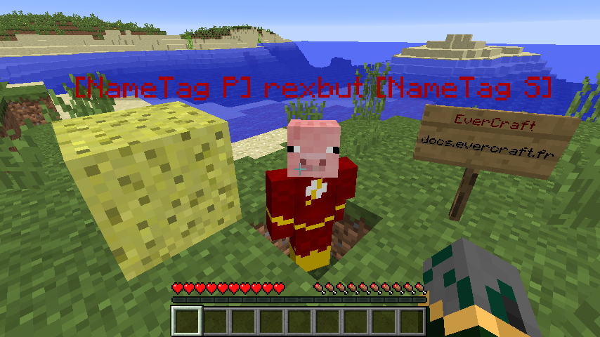

=======
NameTag
=======

   
Le TabList permet de faire afficher un message haut et bas dans la liste des joueurs, mais aussi de modifier leurs DisplayName.

Pour plus d'information sur le fonctionnement du DisplayName : :doc:`../../everchat/format_displayname`

Configuration
~~~~~~~~~~~~~

.. warning::
		Le prefix et le suffix du NameTag sont limité à 16 caractères chaqu'un.

Le fichier de configuration se trouve dans : ``/config/everinformations/nametag.conf``

.. code-block:: bash
	
	# Permets d'activer ou de désactiver la fonctionnalité
	enable=true
	
	# Le délais d'actualisation des DisplayName en seconde (Pour désactiver : -1)(Par défaut : -1)
	update=-1
	
	# Le nom de l'Option qui sera pris pour Prefix (Fournit par le PermissionService)
	prefix="prefix"
	
	# Le nom de l'Option qui sera pris pour Suffix (Fournit par le PermissionService)
	suffix="suffix"