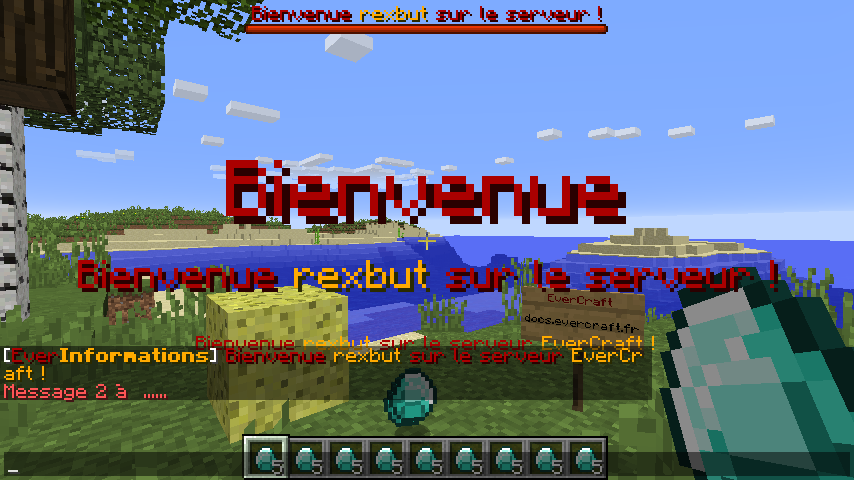

=========
ActionBar
=========

Newbie ActionBar permet de faire afficher des messages dans l'ActionBar lors de la première connexion d'un joueur. Il existe deux types de messages : les messages pour le nouveau joueur et les messages pour les autres joueurs qui sont déjà connectés sur le serveur.

Tous les messages sont définis dans le fichier de configuration et ils peuvent contenir des `Variables Globales <../../everapi/variables.html#variables-globales>`_ et des `Variables Joueurs <../../everapi/variables.html#variables-joueurs>`_.

Configuration simple
~~~~~~~~~~~~~~~~~~~~

Le fichier de configuration se trouve dans : ``/config/everinformations/newbie/newbie_actionbar.conf``

.. code-block:: bash

	# Pour le nouveau joueur
	player {
		# Permets d'activer ou de désactiver la fonctionnalité
		enable=true
		
		# Le temps d'apparition de ce message (en seconde) 
		stay=30
		
		# Le message
		message="&4Bienvenue &6{DISPLAYNAME} &4sur le serveur &6{SERVER_NAME} &4!"
	}
	
	# Pour les autres joueurs
	others {
		# Permets d'activer ou de désactiver la fonctionnalité
		enable=true
		
		# Le temps d'apparition de ce message (en seconde) 
		stay=10
		
		# Le message
		message="&6{DISPLAYNAME} &4est un nouveau joueur !"
	}

Configuration Avancée
~~~~~~~~~~~~~~~~~~~~~~

Le fichier de configuration se trouve dans : ``/config/everinformations/newbie/newbie_actionbar.conf``

.. code-block:: bash

	# Pour le nouveau joueur
	player {
		# Permets d'activer ou de désactiver la fonctionnalité
		enable=true
		
		# Le temps entre chaque message (en seconde)
		interval=0
		
		# Le temps d'apparition de chaque message (en seconde) 
		stay=30
		
		# La liste des messages
		messages=[
			# Configuration normale
			"&4Bienvenue &a{DISPLAYNAME} &4sur le serveur &6{SERVER_NAME} &c!",
			
			# Configuration avancée
			{
				# Le temps avant le prochaine message (en seconde)
				next=20
				
				# Le format du message : FORMATTING_CODE|JSON (Format par défaut : FORMATTING_CODE)
				format="FORMATTING_CODE"
				
				# Le message en FORMATTING_CODE
				message="&cMessage 2 à  ......"
			},
			
			# Configuration normale
			"&bMessage 3 ......"
		]
	}
	
	# Pour les autres joueurs
	others {
		# Permets d'activer ou de désactiver la fonctionnalité
		enable=true
		
		# Le temps entre chaque message (en seconde)
		interval=0
		
		# Le temps d'apparition de chaque message (en seconde) 
		stay=10
		
		# La liste des messages
		messages=[
			# Configuration normale
			"&a{DISPLAYNAME} &4est un nouveau joueur !",
			
			# Configuration avancée
			{
				# Le temps avant le prochaine message (en seconde)
				next=20
				
				# Le temps d'apparition de ce message (en seconde) 
				stay=15
				
				# Le format du message : FORMATTING_CODE|JSON (Format par défaut : FORMATTING_CODE)
				format="JSON"
				
				# Le message en JSON
				message="{\"hoverEvent\":{\"action\":\"show_text\",\"value\":\"Message Hover\"},\"text\":\"Message en JSON\"}"
			},
			
			# Configuration normale
			"&bMessage 3 ......"
		]
	}