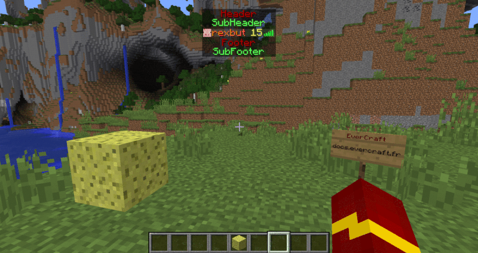

====
List
====

Le ScoreBoard List permet de faire affiché un nombre à droite de chaque pseudo dans le `TabList <../../minecraft/tablist.html>`_. 

Les nombres à afficher doit être pris dans `la liste des Scores <../../everapi/scores.html>`_ (HEALTH, PING, BALANCE...), il sera automatique actualiser.

Configuration simple
~~~~~~~~~~~~~~~~~~~~

Le fichier de configuration se trouve dans : ``/config/everinformations/scoreboard/scoreboard_list.conf``

.. code-block:: bash
	
	# Permets d'activer ou de désactiver la fonctionnalité
	enable=true
	
	# Le Score qui sera affiché : (HEALTH|HEALTH_HEARTS|BALANCE|PING|FOOD...)
	type=HEALTH
	
Configuration Avancée
~~~~~~~~~~~~~~~~~~~~~~

Le fichier de configuration se trouve dans : ``/config/everinformations/scoreboard/scoreboard_list.conf``

.. code-block:: bash
	
	# Permets d'activer ou de désactiver la fonctionnalité
	enable=true
	
	# Le temps d'apparition de chaque objective en seconde (Par défaut : 60)
	stay=60
	
	# Le délais d'actualisation des Scores qui ne sont pas automatique (PING) en seconde (Par défaut : 20)
	update=30
	
	# La liste des objectives qui seront affiché chaqu'un leur tour
	objectives=[
		# Configuration simple
		{
			# Le Score qui sera affiché dans cet objective :
			type=HEALTH_HEARTS
		},
		
		# Configuration avancée
		{
			# Le Score qui sera affiché dans cet objective :
			type=PING
			
			# Le temps d'apparition de cet objective en seconde
			stay=30
			
			# Le délais d'actualisation cet objective
			update=5
		}
	]