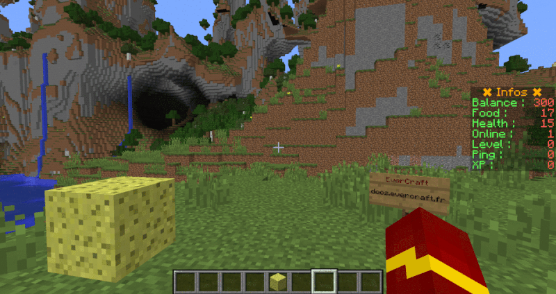

=======
SideBar
=======

   
Le ScoreBoard SideBar permet de faire affiché des informations à droite de l'écran du joueurs. 

Il existe pour le moment 4 types de sidebar (NUMBERS|INFORMATIONS|ECONOMY|STATS). Le titre de la SideBar peut aussi être dynamique.
   
Configuration simple
~~~~~~~~~~~~~~~~~~~~

Le fichier de configuration se trouve dans : ``/config/everinformations/scoreboard/scoreboard_sidebar.conf``

.. code-block:: bash
	
	# Permets d'activer ou de désactiver la fonctionnalité
	enable=true
	
	# La liste des objectives
	objectives=[
		{
			# Titre de l'objective
			title="&6✖ Infos ✖"
			
			# Le type de l'objective (NUMBERS|INFORMATIONS|ECONOMY|STATS)
			type=NUMBERS
			
			# Liste des scores de l'objective
			scores {
				"&aBalance :"=BALANCE
				"&aFood :"=FEED
				"&aHealth :"=HEALTH_HEARTS
				"&aLevel :"=LEVEL
				"&aOnline :"=ONLINE_PLAYERS_CANSEE
				"&aPing :"=PING
				"&aXP :"=XP
			}
		}
	]
	
Configuration Avancée
~~~~~~~~~~~~~~~~~~~~~

Le fichier de configuration se trouve dans : ``/config/everinformations/scoreboard/scoreboard_sidebar.conf``

.. code-block:: bash
	
	# Permets d'activer ou de désactiver la fonctionnalité
	enable=true
	
	# Le temps d'apparition de chaque objective en seconde (Par défaut : 300)
	stay=200
	
	# Le délais d'actualisation des Scores qui ne sont pas automatique (PING) en seconde (Par défaut : 20)
	update=30
	
	# Le temps d'apparition d'un titre en seconde (Par défaut : 300)
	title_stay=200
	
	# La liste des objectives qui seront affiché chaqu'un leur tour
	objectives=[
		# Configuration avancée
		{
			# Le temps d'apparition d'un titre dans cet objective
			title_stay=100
			
			# La liste des titres de cet objective
			titles=[
				# Configuration simple
				"&cTitle 1",
				
				# Configuration avancée
				{
					# Le titre
					title="&cTitle 2"
					
					# Le temps d'apparition de ce titre
					stay=20
				},
				
				# Configuration simple
				"&cTitle 3"
			]
			
			# Le type de l'objective (NUMBERS|INFORMATIONS|ECONOMY|STATS)
			type=NUMBERS
			
			# Liste des scores de l'objective
			scores {
				"&aBalance :"=BALANCE
				"&aFood :"=FEED
				"&aHealth :"=HEALTH_HEARTS
				"&aLevel :"=LEVEL
				"&aOnline :"=ONLINE_PLAYERS_CANSEE
				"&aPing :"=PING
				"&aXP :"=XP
			}
		}, 
		
		# Configuration simple
		{
			# Titre de l'objective
			title="&6✖  Top eco ✖"
			
			# Le type de l'objective (NUMBERS|INFORMATIONS|ECONOMY|STATS)
			type=ECONOMY
			
			# Le format des informations de l'objective
			format="&a<player>"
		}
	]
	
Types
~~~~~

Pour le moment il existe uniquement 4 types de sidebar :

Numbers
-------

Les nombres à afficher doivent être pris dans :doc:`la liste des Scores <../../everapi/scores>`, ils seront automatiquent actualiser.

.. code-block:: bash

	# Titre de l'objective
	title="&6✖ Infos ✖"
	
	# Le type de l'objective
	type=NUMBERS
	
	# Liste des scores de l'objective
	scores {
		"&aBalance :"=BALANCE
		"&aFood :"=FEED
		"&aHealth :"=HEALTH_HEARTS
		"&aLevel :"=LEVEL
		"&aOnline :"=ONLINE_PLAYERS_CANSEE
		"&aPing :"=PING
		"&aXP :"=XP
	}

Informations
------------

Les informations peuvent contenir des `Variables Globales <../../everapi/variables.html#variables-globales>`_ et des `Variables Joueurs <../../everapi/variables.html#variables-joueurs>`_, ils seront automatiquent actualiser.

.. code-block:: bash

	# Titre de l'objective
	title="&6✖ EverCraft ✖"
	
	# Le type de l'objective
	type=INFORMATIONS
	
	# Liste des scores de l'objective
	scores {
		"9"="&1"
		"8"="&aJoueur"
		"7"="&4  {ONLINE_PLAYERS_CANSEE}"
		"6"="&2"
		"5"="&aTeamSpeak :"
		"4"="&4  ts.evercraft.fr"
		"3"="&3"
		"2"="&aSite Web :"
		"1"="&4  evercraft.fr"
		"0"="&4"
	}

Economy
-------

.. code-block:: bash

	# Titre de l'objective
	title="&6✖ Top eco ✖"
	
	# Le type de l'objective
	type=ECONOMY
	
	# Le format des informations de l'objective
	format="&a<player>"

Stats
-----

.. code-block:: bash

	# Titre de l'objective
	title="&6✖ Top Kill ✖"
	
	# Le type de l'objective
	type=STATS
	
	# Le format des informations de l'objective
	format="&a<player>"
	
	# Le type de statistique (KILLS|DEATHS|RATIO)
	top=KILLS
	
	# Sûre combien de temps (ALL|MONTH|WEEK|DAY)
	time=MONTH
