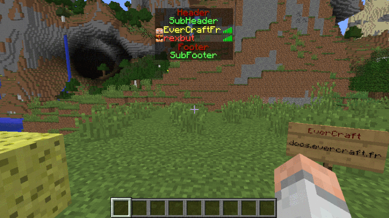

=======
TabList
=======

   
Le TabList permet de faire afficher un message haut et bas dans la liste des joueurs, mais aussi de modifier leurs DisplayName.

Tous les messages peuvent contenir des `Variables Globales <../everapi/variables.html#variables-globales>`_ et des `Variables Joueurs <../../everapi/variables.html#variables-joueurs>`_.

Pour plus d'information sur le fonctionnement du DisplayName : :doc:`../../everchat/format_displayname`

Configuration simple
~~~~~~~~~~~~~~~~~~~~

Le fichier de configuration se trouve dans : ``/config/everinformations/tablist.conf``

.. code-block:: bash
	
	# Permets d'activer ou de désactiver la fonctionnalité
	enable=true
	
	# Le message en haut du TabList
	header="&5✖ &fVous êtes connecté sur &6{SERVER_NAME} &5✖"
	
	# Le message en bas du TabList
	footer="&fNew, Forums et boutique &ahttps://evercraft.fr"
	
	# Contrairement au NameTag le displayname du TabList n'est pas limité en caractères 
	# donc il est possible de différencier les deux DisplayName
	displayname {
		# Le nom de l'Option qui sera pris pour Prefix (Fournit par le PermissionService)
		prefix="prefix"
		
		# Le nom de l'Option qui sera pris pour Suffix (Fournit par le PermissionService)
		suffix="suffix"
	}

Configuration Avancée
~~~~~~~~~~~~~~~~~~~~~

Le fichier de configuration se trouve dans : ``/config/everinformations/tablist.conf``

.. code-block:: bash

	# Permets d'activer ou de désactiver la fonctionnalité
	enable=true
	
	# Le temps d'apparition des TabLists en seconde (Par défaut : 20)
	stay=30
	
	# Le délais d'actualisation des Variables qui ne sont pas automatique (PING) en seconde (Par défaut : 20)
	update=20
	
	tablists=[
		# Configuration simple
		{
			# Le message en haut du TabList
			header="&5✖ &fVous êtes connecté sur &6{SERVER_NAME} &5✖"
			
			# Le message en bas du TabList
			footer="&fNew, Forums et boutique &ahttps://evercraft.fr"
		},
		
		# Configuration avancée
		{
			# Le temps d'apparition du TabList en seconde
			stay=60
			
			# Le délais d'actualisation de ce TabList
			update=2
			
			# Le message en haut du TabList 
			header="&4Header[RT]&aSubHeader"
			
			# Le message en bas du TabList
			footer="&4Footer[RT]&aSubFooter"
		}
	]
	
	# Contrairement au NameTag le displayname du TabList n'est pas limité en caractères 
	# donc il est possible de différencier les deux DisplayName
	displayname {
		# Le nom de l'Option qui sera pris pour Prefix (Fournit par le PermissionService)
		prefix="prefix_unlimited"
		
		# Le nom de l'Option qui sera pris pour Suffix (Fournit par le PermissionService)
		suffix="suffix_unlimited"
		
		# Le délais d'actualisation des DisplayName en seconde (Pour désactiver : -1)(Par défaut : -1)
		update=20
	}