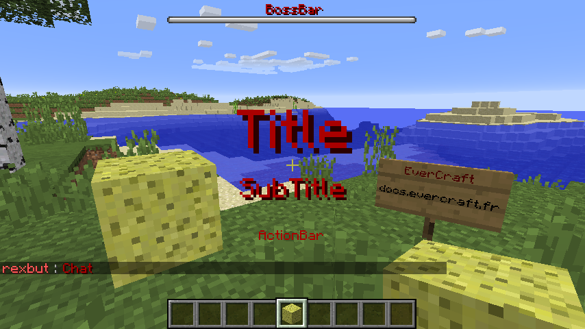
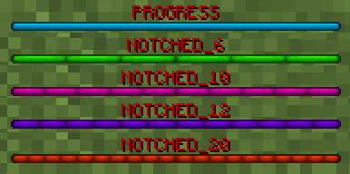

========
Messages
========

   
Sur Minecraft il existe 5 types de messages. Il est possible d'utiliser de la :doc:`mise en forme <format>` pour les messages.

Le plus utilisé est le tChat mais l'inconvénient est que les messages sont permanents contrairement aux autres types.
   
tChat
~~~~~

Les messages du ``tChat`` sont affiché en bas à gauche de l'écran du joueur.

**Les avantages :**

* Faire défiler la liste des messages avec la molette de la souris
* ``Hover`` : Afficher un message lorsque le curseur la souris survole un mot
* ``Suggest`` : Préremplir la barre du tChat lorsque l'on clique sur un mot
* ``Command`` : Exécuter une commande lorsque l'on clique sur un mot
* ``URL`` : Ouvrir une url lorsque l'on clique sur un mot

**Les inconvénients :**

* Peu très rapidement bloquer la vue du joueur

ActionBar
~~~~~~~~~

Le message de l'``ActionBar`` est affiché juste aussi de la HotBar.

**Les avantages :**

* ``Stay`` : Délais d'affichage du message

**Les inconvénients :**

* Un seul message à la fois
* Aucun retour à la ligne
* Message très peu visible

Title
~~~~~~~~~
Le ``Title`` permet de faire afficher 2 messages (Title, SubTitle) en plein milieu de la l'écran.

**Les avantages :**

* ``Stay`` : Délais d'affichage du message
* ``FadeIn`` : Fondu d'apparition
* ``FadeOut`` : Fondu de disparition

**Les inconvénients :**

* Un seul à la fois
* Aucun retour à la ligne
* Bloque la vue du joueur
   
BossBar
~~~~~~~

Les ``BossBar`` permettent de faire afficher des messages en haut de l'écran.

**Les avantages :**

* ``Stay`` : Délais d'affichage du message
* ``Color`` : Changer la couleur de la barre (BLUE|GREEN|PINK|PURPLE|RED|WHITE|YELLOW)
* ``Percent`` : Changer le pourcentage de la barre (0 à 100)
* ``Overlay`` : Changer le style de la barre (NOTCHED_6|NOTCHED_10|NOTCHED_12|NOTCHED_20|PROGRESS)
* ``CreateFog`` : Créer le brouillard
* ``DarkenSky`` : Obscurcir le ciel
* ``PlayEndBossMusic`` : Jouer la musique de départ

**Les inconvénients :**

* Aucun retour à la ligne
* Obligation d'avoir une barre juste en dessous
