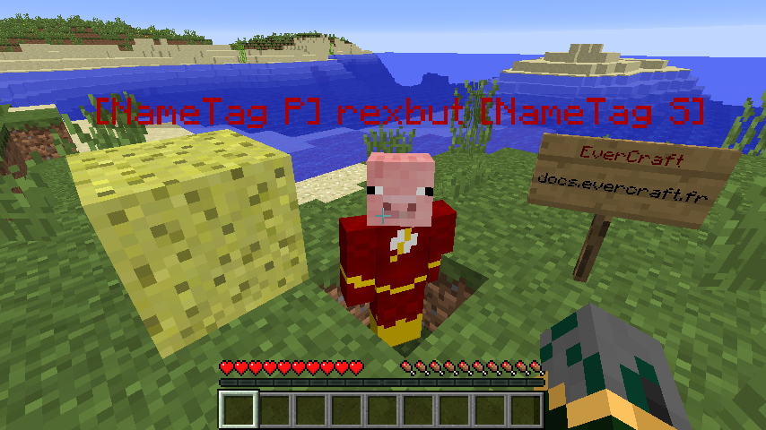

=======
NameTag
=======

Le NameTag peut contenir 2 valeurs (Prefix, Suffix) de 16 caractères. Les valeurs seront affichées au dessus des joueurs. De la :doc:`mise en forme <format>` peut être utilisée dans les messages et il n'est pas possible de faire de retour à la ligne.

Le ``Prefix`` sera affiché juste avant le pseudo du joueur et le ``Suffix`` juste après.
