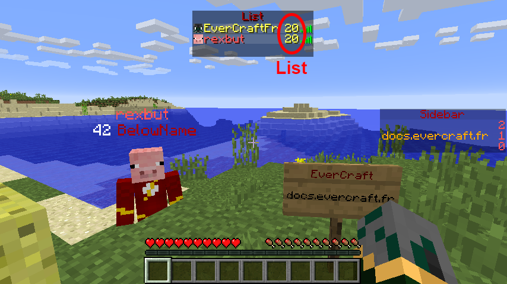

==========
ScoreBoard
==========

   
Sur Minecraft il existe 3 types de scoreboard. Les scoreboards permettent de faire afficher quelques informations sur l'écran du joueur.

Le plus utilisé est la Sidebar car il reste afficher en permanence sur l'écran du joueur.

Sidebar
~~~~~~~

Le ``Sidebar`` se trouve à droite de l'écran du joueur et peu contenir jusqu'à 16 informations.

List
~~~~

Le ``List`` se trouve dans le tablist et peut contenir qu'une information sur chaque joueur connecté.

BelowName
~~~~~~~~~

Le ``BelowName`` se trouve en dessus des pseudos des joueurs et peut contenir qu'une information sur chaque joueur connecté.
