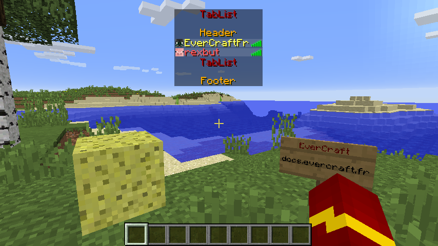

=======
TabList
=======

   
Le TabList peut contenir 2 messages (Header, Footer). De la :doc:`mise en forme <format>` peut être utilisé dans les messages et il possible de faire des retours à la ligne.

Le ``Header`` est haut dessus de la liste des joueurs et le ``Footer`` est en dessus.
